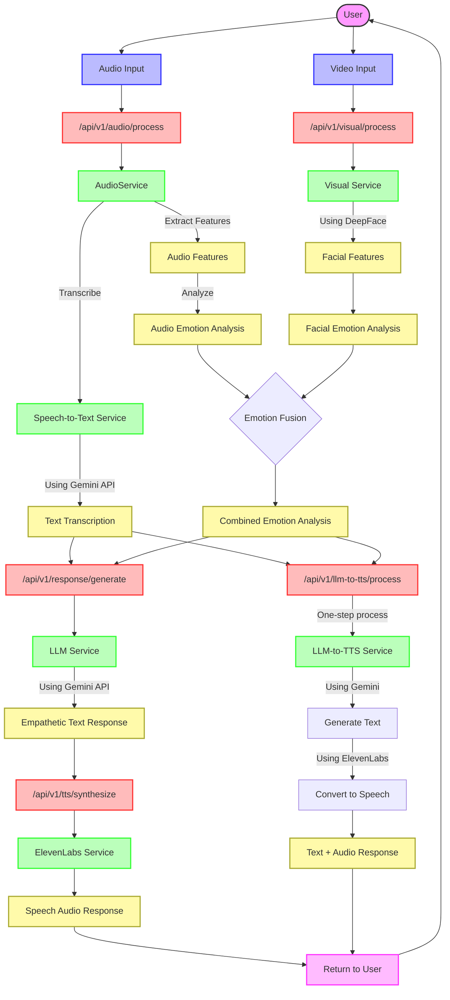

# Mirror Mirror on the Wall: System Workflow

## API Routes and Data Flow

### 1. Audio Processing Route
- **Endpoint**: `/api/v1/audio/process`
- **Input**: Audio file (WAV, MP3, FLAC)
- **Process**: 
  1. Extract audio features (volume, pitch, rate, pauses)
  2. Transcribe speech using Gemini API
  3. Analyze emotion from audio characteristics
- **Output**: `AudioProcessingResult` with transcription and emotion analysis

### 2. Visual Processing Route
- **Endpoint**: `/api/v1/visual/process`
- **Input**: Video frame or image with face
- **Process**:
  1. Detect facial landmarks using DeepFace
  2. Extract facial features (eye openness, mouth position, etc.)
  3. Classify emotions from facial expressions
- **Output**: `VisualProcessingResult` with facial features and emotion prediction

### 3. Response Generation Route
- **Endpoint**: `/api/v1/response/generate`
- **Input**: User text and emotion analysis
- **Process**:
  1. Format prompt with emotional context
  2. Generate empathetic response using Gemini LLM
- **Output**: `GeneratedResponse` with text response

### 4. Text-to-Speech Route
- **Endpoint**: `/api/v1/tts/synthesize`
- **Input**: Text to convert to speech
- **Process**:
  1. Send text to ElevenLabs API
  2. Generate natural-sounding speech
- **Output**: Audio file URL and data

### 5. Combined LLM-to-TTS Workflow
- **Endpoint**: `/api/v1/llm-to-tts/process`
- **Input**: User text and emotional context
- **Process**:
  1. Generate text response with Gemini LLM
  2. Convert response to speech using ElevenLabs
- **Output**: `LLMToTTSResponse` with both text and audio URL

### 6. Asynchronous LLM-to-TTS Workflow
- **Endpoint**: `/api/v1/llm-to-tts/process-async`
- **Input**: Same as synchronous version
- **Process**:
  1. Generate text response immediately
  2. Queue speech synthesis to run in background
- **Output**: Immediate text response, audio processed asynchronously

## Data Models and Transfer

- **Audio Models**: `AudioFeatures`, `AudioTranscription`, `AudioEmotionPrediction`
- **Visual Models**: `FacialFeatures`, `FacialEmotionPrediction`
- **Response Models**: `GeneratedResponse`, `LLMToTTSResponse`
- **Combined Models**: `CombinedEmotionAnalysis` (fusion of audio and visual emotions)

This workflow architecture enables multi-modal emotion analysis by combining both audio and visual cues, leading to more accurate empathetic responses. 